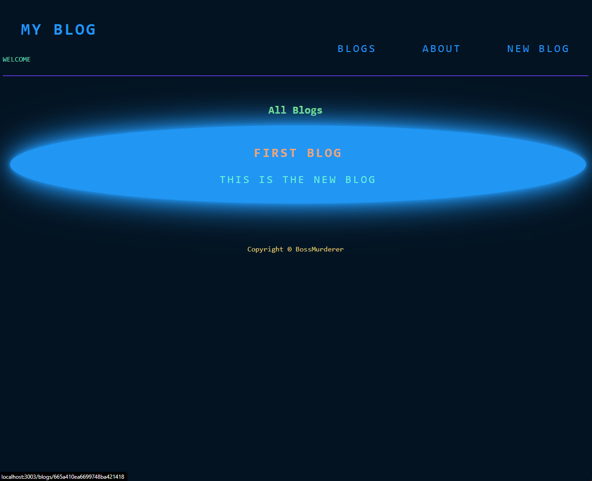
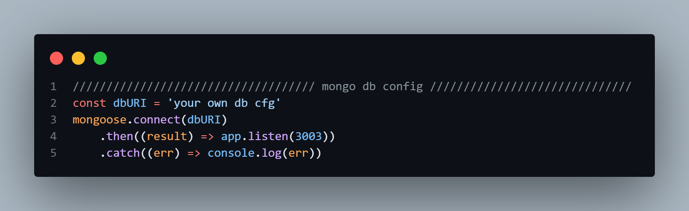

## Titles

- [About](#about)
- [Packages](#packages)
- [What This App Can Do](#what-this-app-can-do)
- [Configs](#configs)
- [Database](#database)
- [Outro](#outro)


## About

This app is built with `Node.Js` and other packages.
Also ,for better visualization and clean coding, i used `MVC` structure in this application and considered `MongoDB` for database.

## Packages

I used these packages, be sure to install them:

+ [Express](https://www.npmjs.com/package/express)
```
$ npm i express
```
+ [Ejs](https://www.npmjs.com/package/ejs)
```
$ npm i ejs
```
+ [Mongoose](https://www.npmjs.com/package/mongoose)
```
$ npm i mongoose
```
+ [Nodemon](https://www.npmjs.com/package/nodemon)
```
$ npm i nodemon
```

 


## What This App Can Do

The app has a `Main page` to see all blogs that you can create in the `New blog` page and also you can delete them in the `Details page`.
At the end you can write about yourself in the `About page`.




## Configs

The main cfg to run this aoo is app.js.
You can use the `nodemon` package to run this application easily.
The app is running on `3003` port.


## Database
As you know, MongoDB is a NoSQL database.
I used mongoose package to configure MongoDB.
Mongoose is a MongoDB object modeling tool designed to work in an asynchronous environment.
Also included a section for MongoDB configs where you can enter your database cfg.




## Outro
Hope you enjoy it and develop or use this simple mini app in your own projects.


`Built With :)`


